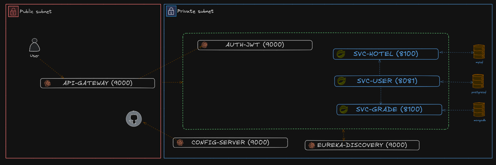

# spring-cloud-hotel-microservices-mvc
Hotel management system built with Spring Boot and Spring Cloud microservices (MVC), using Eureka, Load Balancing, Resilience4J, RestTemplate, OpenFeign, JWT-based security, and Docker.

## Architecture Microservices
